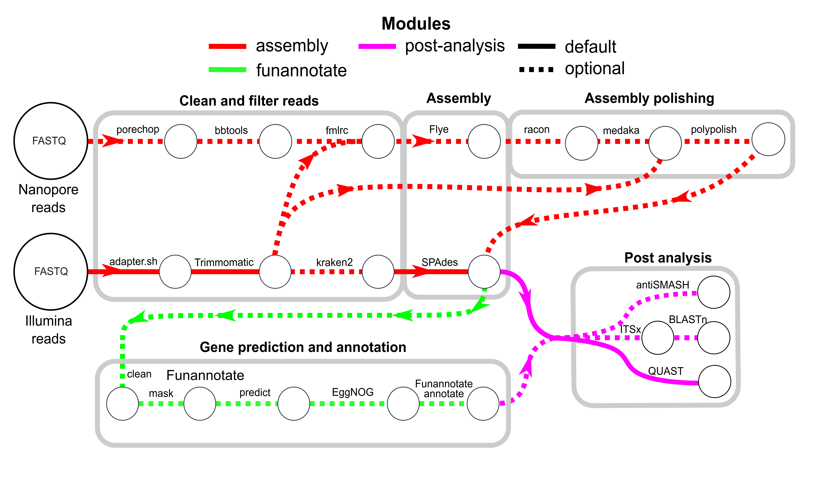

# Fungiflow

## Overview

Repeatable, parallelized, readable, and user friendly workflow for identifying fungal biosynthetic gene clusters (BGCs) from low-coverage short read Illumina sequence data with minimal inputs. This pipeline is mostly written in `python3`.


*Overview of fungiflow pipeline*

The overall workflow is defined by several modules:
1. Assembly module
    1. Trimming of short Illumina reads with Trimmomatic
    2. Trimming of long MinION reads with porechop
    3. Correction of trimmed MinION reads with FMLRC, using trimmed short reads
    4. (OPTIONAL) Filtering out non-eukaroytic contamination with Kraken2 (standard database | Oct 2020)
    5. QC of trimmed and filtered reads with FastQC
    6. Assembly:
        - SPAdes for assembly with short Illumina sequence reads
        - Flye for hybrid assembly with short Illumina and long MinION sequence reads
2. (OPTIONAL) Annotation module:
    1. Cleaning, sorting, soft masking, and gene prediction of contigs with the Funannotate pipeline (v1.8.3)
3. Post-analysis module:
    1. Evaluations of assemblies using QUAST
    2. (OPTIONAL) Annotation and extraction of ITS regions using ITSx and BLASTn of ITS sequences (ITS_Refseq_Fungi | Oct 2020)
    3. (OPTIONAL) Identification of BGCs using antiSMASH (v5.1.3)
    4. Report generation
4. (OPTIONAL) Blobplot module:
    1. Minimap2 maps short reads to assembly file in BAM format
    2. Samtools indexes the BAM file 
    3. MegaBLAST assigns taxonomy to each contig (NCBI-nt | Jun 2022)
    4. Blobtools generates blobplots

### Low-coverage genome assembly
Generating sequencing data can be expensive, but you can get data on more strains if you sequence these strains to low coverage. This can be useful for identifying strains that contain features of interest, in this case BGCs (*There is an accessory script, `cluster_search_v3.py` that can identify discrete BGCs across fragmented genome assemblies using user-supplied pHMMs*). These strains of interest can then be sequenced to a higher coverage using further short reads or MinION long reads and a more thorough examination performed. 
Below is some examples of test runs using synthetic paired Illumina 150 bp short reads generated from 10 diverse fungal strains of differing coverages.
The tests from the same synthetic read datasets as above showed that even short read coverage coverage as low as 10× can result in an assembly that is of similar size and content to the reference.


## Installation
Clone this GitHub repositroy by entering ```git clone https://github.com/kellystyles/fungiflow.git``` in the directory you would like to install in. You could add this directory to your PATH. 
```
export PATH=$PATH:/path/to/fungiflow/ >> ~/.bashrc
source ~/.bashrc
```

This pipeline runs from several Singularity containers to ensure a repeatable and consistent output from input data. Download these from Singularity Hub as so:
```
singularity pull library://kellystyles/fungiflow/fungiflow_v2.sif       - for the main pipeline image
singularity pull library://kellystyles/fungiflow/funannotate_v2.sif     - for the funannotate image
singularity pull library://kellystyles/fungiflow/antismash_v2.sif       - for the antismash image
```

Consequently, the only dependency required is `singularity`, as well as several third party `python3` libraries, including `numpy` and `pandas`, and optionally `seaborn`. These can be easily installed using `mamba` (a faster version of conda) as so:
```
mamba create -n fungiflow python3
source activate fungiflow
mamba install numpy pandas seaborn
mamba deactivate
```

### GeneMark-ES gene predictions
If you wish to use the optional Funannotate module, you may wish to obtain a copy of the GeneMark-ES software and the license to use it. GeneMark-ES provides high quality predictions of genes for fungal assemblies, but due to licensing it cannot be bundled with the Fungiflow Singularity images. It is obtainable from [here](http://topaz.gatech.edu/GeneMark/license_download.cgi).  Extract the license key `gm_key_64` file to `~/` as so:
```
tar -xvzf gm_key_64.tar.gz -O gm_key & mv gm_key ~/.gm_key
```
You can supply the path to the GeneMark-ES bin using the `--genemark_path` parameter of the main script.

### Databases

Several databases are needed for optional fungiflow modules to operate correctly. These can be installed by running the `install.py` script.
```
python3 install.py --help
```
All core databases are bundled within the Singularity containers so you can perform a basic run straight out of the box. The following optional databases are pretty large so the install may take several hours to download with 4 CPUs:
    - Kraken2 standard database ( 213 GB | ~6 hours); required for taxonomic filtering of short reads.
    - ITS_Refseq_Fungi database ( 162 Mb | 20 mins); required for BLASTn of extracted ITS sequences.
    - NCBI-nt database (132 GB | ~4 hours); required for assigning taxonomy to contigs for the Blobplots module.
Note that these databases may differ to the ones stated in the workflow as they might be more up to date.

## Usage
A typical run of the core modules can be run like:
```
python3 fungiflow.py -if shortf_reads_path -ir shortr_reads_path -data database_path
```
Usage can be shown using `python3 fungiflow.py --help`.
```
usage: fungiflow.py [-h] -d DIRECTORY -if ILLUMINA_F -ir ILLUMINA_R -a ARRAY -c CPUS -m MEM 
                    [-ant] [-f] [-s SINGULARITY_IMAGE] [-data DATABASE_PATH] 
                    [-sf SINGULARITY_FUNANNOTATE] [-sa SINGULARITY_ANTISMASH] 
                    [-its] [-k] [-e] [-b] [-idb ITS_DB] [-kdb KRAKEN2_DB] 
                    [-bdb BLOB_DB] [-edb EGGNOG_DB] [-n NANOPORE] 
                    [-t {isolate,metagenomic}] [-minlen MINIMUM_LENGTH] 
                    [-mtm MIN_TRAINING_MODELS] [--careful] 
                    [--genemark_path GENEMARK_PATH] [--print_workflow]

Fungiflow - the automated eukaryotic genomic pipeline for fungi.

optional arguments:
  -h, --help            show this help message and exit
  -d DIRECTORY, --directory DIRECTORY
                        Working directory path.
  -if ILLUMINA_F, --illumina_f ILLUMINA_F
                        Illumina short forward reads path
  -ir ILLUMINA_R, --illumina_r ILLUMINA_R
                        Illumina short reverse reads path
  -a ARRAY, --array ARRAY
                        a unique value
  -c CPUS, --cpus CPUS  Number of threads to use
  -m MEM, --mem MEM     Amount of memory to use (in GB)
  -ant, --antismash     Add this argument if you would like to search the assembly for BGCs
  -f, --funannotate     Add this argument if you would like to annotate the assembly
  -s SINGULARITY_IMAGE, --singularity_image SINGULARITY_IMAGE
                        Primary Singularity image for Fungiflow
  -data DATABASE_PATH, --database_path DATABASE_PATH
                        Path to installed databases
  -sf SINGULARITY_FUNANNOTATE, --singularity_funannotate SINGULARITY_FUNANNOTATE
                        Singularity image for Funannotate
  -sa SINGULARITY_ANTISMASH, --singularity_antismash SINGULARITY_ANTISMASH
                        Singularity image for antiSMASH
  -its, --its           Search assembly for ITS sequences. Part of post-analysis module.
  -k, --kraken2         Run trimmed reads against Kraken2 standard database. Will save unclassified reads (i.e., not matching the standard database), which will be used for assembly.  
                        Part of taxonomic module.
  -e, --eggnog          Functionally annotate the assembly proteins with eggnog. Part of annotation module.
  -b, --blobplot        Run blobtools module on output assembly. Part of blobtools module.
  -idb ITS_DB, --its_db ITS_DB
                        Path to alternative ITS_refseq BLASTn database.
  -kdb KRAKEN2_DB, --kraken2_db KRAKEN2_DB
                        Path to alternative Kraken2 standard database.
  -bdb BLOB_DB, --blob_db BLOB_DB
                        Path to alternative NCBI-nt database for blobtools.
  -edb EGGNOG_DB, --eggnog_db EGGNOG_DB
                        Path to alternative eggnog database for eggnog.
  -n NANOPORE, --nanopore NANOPORE
                        Path to MinION reads.
  -t {isolate,metagenomic}, --type {isolate,metagenomic}
                        Sequence data source type. Accepted arguments are 'isolate' and 'metagenomic'
  -minlen MINIMUM_LENGTH, --minimum_length MINIMUM_LENGTH
                        Minimum length of long-reads to retain during QC processes. Default is 2000 bp.
  -mtm MIN_TRAINING_MODELS, --min_training_models MIN_TRAINING_MODELS
                        Mininum number of predicted models to train Augustus. Default is 200.
  --careful             Assembles reads with SPAdes using lower k-mer values and runs in single cell mode.
  --genemark_path GENEMARK_PATH
                        Path to GeneMark-ES script.
  --print_workflow      Will print a summary of the workflow upon completion of the script
```

There is a SLURM script for running the pipeline on your SLURM-compatible HPC. Edit this with your specific variables prior to use.
``` 
sbatch fungiflow_slurm.sh
```

### Speed
This workflow is designed to operate on an HPC, so expects a lot of CPUs and memory. I would suggest a minimum of 16 cpus and 32 GB of memory. If you would like to perform taxonomic filtering of short reads with `kraken2`, increase the memory to at least 100 Gb as the entire hash table will need to be loaded into memory.
The tests from the same synthetic read datasets as above showed CPU and memory efficiency as below:


## Output
### Files/Directory Tree
After cloning into the fungiflow GitHub repository, create a new project folder in `/fungiflow/projects/`. In this folder, create a nested directory named `data/raw` and place all raw Illumina sequence reads into this folder in `*fq.gz format` (no preprocessed reads). The final path should look like `/fungiflow/projects/project_name/data/raw`.

To utilise parallel computing, sequence read names can be appeneded with an array value and pair information. This can be automatically performed by running `name_change.sh` in the `/fungiflow/scripts` folder as below. This will return a `filenames.txt` document which lists the name of each sequence file and the number prepended to it.
```
bash name_change.sh ...
```

```
project directory
│   (array1_val)_F.fq.gz
│   (array1_val)_R.fq.gz
│   (array1_val)_ONT_reads.fq.gz  
│   ...
│
└───adapters
│   │   (array1_val)_adapters.fasta       # FASTA file of adapters found in reads
│   │   (array1_val)_adapters.fasta
│   │   ...
│
└───trimmed
│   │   (array1_val)_trimmed_1P.fq.gz     # short paired forward trimmed reads
│   │   (array1_val)_trimmed_1U.fq.gz     # short unpaired forward trimmed reads
│   │   (array1_val)_trimmed_2P.fq.gz     # short paired reverse trimmed reads
│   │   (array1_val)_trimmed_2U.fq.gz     # short unpaired reverse trimmed reads
│   │   (array1_val)_ONT_reads.fq         # trimmed MinION reads
│   │   (array1_val)_ONT_reads.fa         # trimmed MinION reads in FASTA format
│   │   (array1_val)_ONT_reads_lf.fa      # length-filtered MinION reads
│   │   (array1_val)_ONT_reads_corr.fa    # corrected MinION reads
│   │   (array1_val)_mapped.npy           # short reads mapped to MinION reads
│   │   ...
│
└───kraken2
│   │   (array1_val)_class_1.fq           # classified forward reads
│   │   (array1_val)_unclass_1.fq         # unclassified forward reads
│   │   (array1_val)_class_2.fq           # classified reverse reads
│   │   (array1_val)_unclass_2.fq         # unclassified reverse reads
|   |   ...
│
└───assembly
│   │   (array1_val)_scaffolds.fasta      # SPADes assembly file
|   |   assembly.fasta                    # Flye assembly file
|   |   (array1_val)_ONT_corr.sam         # short reads mapped to Flye assembly
│   │   (array1_val)_pilon.fa             # pilon polished hybrid assembly file
│   │   racon_consensus.fa                # racon polished hybrid assembly file
|   |   racon_consensus.fa.bam            # short reads mapped to racon assembly
|   |   racon_consensus.fa.bam.bai        # index of above file
|   |   racon_consensus.hdf               # corrected MinION reads aligned to racon assembly
|   |   medaka_consensus.fa               # medaka polished hybrid assembly file
|   |   medaka_consensus.sam              # corrected MinION reads aligned to medaka assembly 
|   |   medaka_consensus.bai              # index of above file
|   |   medaka_sorted.sam                 # sorted file of `medaka_consensus.sam` 
|   |   medaka_sorted.sam.bai             # index of above file
|   |   polypolish.fasta                  # final polished hybrid assembly
│   
└───funannotate
│   │
│   └───(array1_val)
│       └───logfiles
│       └───predict_misc
│       └───predict_results
│       |   |   (array1_val).gbk          # GBK file of aseembly with predicted genes
|       └───eggnog
|       |   |   (array1_val).emapper.annotations  # eggnog annotations
│       └───annotate_misc
|       |   |   ...
│       └───annotate_results 
|           |   (array1_val).gbk          # GBK file with annotated genes       
│           |   ...
|
└───antismash
│   │
│   |   (array1_val).gbk                  # GBK file input to antiSMASH
|   |   (array1_val).json                 # JSON file of antiSMASH output
|   |   index.html                        # output HTML viewer
|   |   ...
|
└───quast
│   │
│   |   transposed_report.tsv             # output report file used by this pipeline
|   |   report.html                       # output HTML viewer
|   |   ...
|
└───blobplots
│   │
│   |   assembly.bam                      # short reads mapped to assembly
|   |   assembly.bam.bai                  # index of above file
|   |   assembly.blobDB.json              # blobtools JSON output file
|   |   megablast.out                     # MegaBLAST output
|   |   ...

```   
### Collating data from multiple Fungiflow runs
A handy script `parse_all.py` is provided which will collate various information from each Fungiflow output directory. This will collate data on assembly metrics from `Quast`, single copy orthologs from `BUSCO`, BGC information from `antiSMASH`, and ITS sequence information from `ITSx`. Each output directory will have data collated onto a single row in a CSV file `master_results.csv`. Additionally, all the BGCs from each output directory will be collated into a CSV file `all_bgcs.csv`.

Usage is below, where `parent_directory` is a directory containing Fungiflow output directories.
```
Usage: python3 parse_all.py 'parent_directory'
```
## cluster_search
An accessory script, `cluster_search_v3.py` can identify disparate BGCs that are separated across contigs in low-coverage/discontiguous genome assemblies. This works by searching the proteins from an assembly with gene predictions with user-supplied pHMMs. It can build a pHMM from a multiple alignment as well if necessary. It will apply a set of rules (user-supplied list of pHMMs that must have hits) and collate all hits in a 10 kb context into a GenBank file for each cluster. This script has the dependencies `pyhmmer` and `biopython` (>/1.8) and can be installed using mamba as below:
```
mamba create -n cluster_search python3
source activate cluster_search
mamba install -c conda-forge biopython
mamba install -c bioconda pyhmmer
mamba deactivate
```
### Usage
This script has been tested on a PC with 12 × AMD Ryzen 5 5600X CPUs and 16 GB DDR3 RAM. It was able to search 5 fungal genomes in just under 10 seconds.
```
            |-|-|-|- Cluster Search -|-|-|-| 

usage: cluster_search_v3.py [-h] -g GBK_DIR -p PHMM_DIR [-b] [-a] [-r REQUIRED] [-m TRUSTED_MODIFIER] [-t TRUSTED_CUTOFFS_FILE]

Finds and extracts clusters of biosynthetic genes in an annotated genome using given pHMM models

optional arguments:
  -h, --help            show this help message and exit
  -g GBK_DIR, --gbk_dir GBK_DIR
                        path to genbank file(s)
  -p PHMM_DIR, --phmm_dir PHMM_DIR
                        path to pHMMs
  -b, --build           Build pHMM from multiple sequence alignments. Multiple sequence alignments must be in 'phmm_dir' and have suffix '.msa.fasta'
  -a, --align           Align multi-FASTA to make multiple sequence alignments. multi-FASTA must be in 'phmm_dir' and have suffix '.prots.fasta'
  -r REQUIRED, --required REQUIRED
                        comma-separated list of pHMMs required to be in the cluster, e.g., phmmA,phmmB,phmmC
  -m TRUSTED_MODIFIER, --trusted_modifier TRUSTED_MODIFIER
                        modifier larger than 0 and including 1 for calculating trusted cutoff bitscores. 1 = no cutoff, 0.1 = very stringent. Use 'd' to override existing data and     
                        use defaults
  -t TRUSTED_CUTOFFS_FILE, --trusted_cutoffs_file TRUSTED_CUTOFFS_FILE
                        file containing tab-separated trusted cutoffs for each pHMM, e.g. 'phmmA bitscore'
```
Note above that the varying input FASTA files for `--build` and `--align` will need to have an additional suffix to denote the type of data in each.

Some usage cases are below:

Basic usage: 
    `python3 cluster_search_v3.py -g gbk_dir -p phmm_dir`

Usage if you want to use a modifier for calculating very stringent trusted cutoffs: 
    `python3 cluster_search_v3.py -g gbk_dir -p phmm_dir -m 0.1`

Usage if you want to use a modifier for calculating very relaxed trusted cutoffs: 
    `python3 cluster_search_v3.py -g gbk_dir -p phmm_dir -m 0.9`

Usage if you want to filter hits to list of required pHMM hits: 
    `python3 cluster_search_v3.py -g gbk_dir -p phmm_dir -r list_required_models`

Usage if you want to build pHMMs from multiple sequence alignments:
    `python3 cluster_search_v3.py -g gbk_dir -p phmm_dir -b`

Usage if you want to align a multi-FASTA of proteins and build pHMMs from the multiple sequence alignments:
    `python3 cluster_search_v3.py -g gbk_dir -p phmm_dir -a -b`

Input:
    `--gbk_dir `  =   directory containing genbank files
    `--phmm_dir`  =   directory containing pHMM files
    `--required`  =   (optional) pHMMs that must be included in output clusters


## Planned implementations

- Work will be done to implement multiprocessing for slower parts of the pipeline, particularly lookup/identification tasks (e.g., `MegaBLAST` in the blobplots package).
- Implementation of assembly using only MinION long reads, particularly with the release of the R10 flow cells which purport a >99% accuracy rate.
- Whilst the repeatability and accessibility is ensured by the usage of Singularity containers, a conda environment and PyPI package is planned.