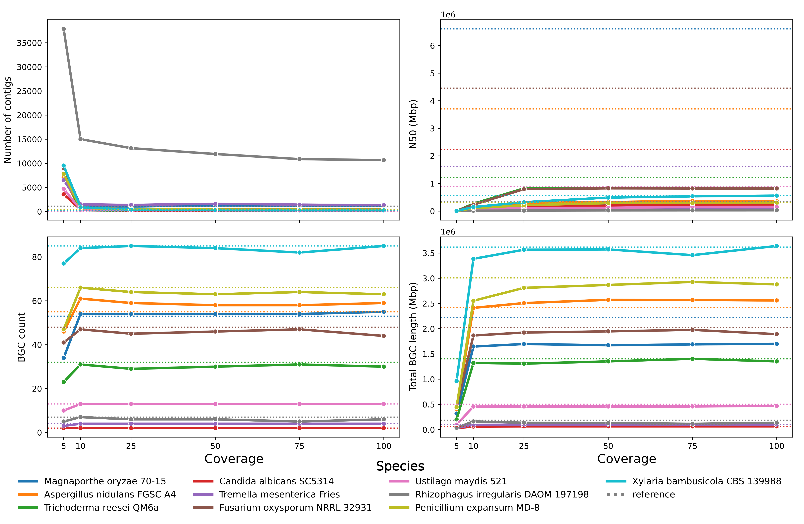

<p align="center">

</p>

## Overview

> A repeatable workflow for identifying fungal biosynthetic gene clusters (BGCs) from low-coverage short read Illumina sequence data with minimal inputs. 

A Python pipeline primarily designed for manipulating fungal low-coverage short read Illumina sequence data in a Unix environment. The primary assembly module will clean and filter short read Illumina sequence data and a post-analysis module will generate summary statistics and extract BGCs with antiSMASH v6.[^1] Optional modules allow decoration of assemblies with gene predictions from the `funannotate` pipeline,[^2] and can assess contamination of the assembly with the `blobtools` software.[^3] Additionally, Fungiflow is also capable of assembling and surveying metagenomic data.

[^1]: Blin, K., Shaw, S., Kloosterman, A. M., Charlop-Powers, Z., Van Wezel, G. P., Medema, M. H., & Weber, T. (2021). antiSMASH 6.0: improving cluster detection and comparison capabilities. *Nucleic acids research*, *49*(W1), W29-W35.
[^2]: Palmer, J., & Stajich, J. (2021). Funannotate v1. 8.3: eukaryotic genome annotation (Version 1.8. 3). *Zenodo. doi*, *10*.
[^3]: Laetsch, D. R., & Blaxter, M. L. (2017). BlobTools: Interrogation of genome assemblies. *F1000Research*, *6*(1287), 1287.


## Fungiflow pipeline

The overall workflow is defined by several modules:
1. **Assembly module**
    1. Trimming of short Illumina reads with Trimmomatic
    2. Trimming of long MinION reads with porechop
    3. Correction of trimmed MinION reads with FMLRC, using trimmed short reads
    4. Filtering out non-eukaroytic contamination with Kraken2 (standard database | Oct 2020) - *OPTIONAL*
    5. QC of trimmed and filtered reads with FastQC
    6. Assembly:
        - SPAdes for assembly with short Illumina sequence reads
        - Flye for hybrid assembly with short Illumina and long MinION sequence reads
2. **Annotation module** - *OPTIONAL*
    1. Cleaning, sorting, soft masking, and gene prediction of contigs with the Funannotate pipeline (v1.8.3)
3. **Post-analysis module**
    1. Evaluations of assemblies using QUAST
    2. Annotation and extraction of ITS regions using ITSx and BLASTn of ITS sequences (ITS_Refseq_Fungi) - *OPTIONAL*
    3. Identification of BGCs using antiSMASH (v6.1) - *OPTIONAL*
    4. Report generation
4. **Blobplot module** - *OPTIONAL*
    1. Minimap2 maps short reads to assembly file in BAM format
    2. Samtools indexes the BAM file 
    3. MegaBLAST assigns taxonomy to each contig (NCBI-nt)
    4. Blobtools generates blobplots

## Low-coverage genome assembly

Generating sequencing data can be expensive, but you can get data on more strains if you sequence these strains to low coverage. This can be useful for identifying strains that contain features of interest, in this case BGCs.

> *[`cluster_search`](https://github.com/kellystyles/cluster_search) can identify discrete BGCs across fragmented genome assemblies using user-supplied pHMMs*. 

These strains of interest can then be sequenced to a higher coverage using further short reads or MinION long reads and a more accurate and complete assembly prepared. 
Below are examples of test runs using synthetic paired Illumina 150 bp short reads generated from 10 taxonomically diverse fungal strains of differing coverages.
The tests showed that even short read coverage coverage as low as 10× can result in an assembly that is of similar size and content to the reference.


## Installation

Clone this GitHub repository by entering the following command in the desired installation directory:

```
git clone https://github.com/kellystyles/fungiflow.git
```

You can add this directory to your PATH by executing the following commands:

```
export PATH=$PATH:/path/to/fungiflow/ >> ~/.bashrc
source ~/.bashrc
```

To ensure a repeatable and consistent output, this pipeline relies on several Singularity containers. Download the required containers from Singularity Hub using the following commands:

```
singularity pull library://styleske/fungiflow/fungiflow                 # main fungiflow image
singularity pull library://kellystyles/fungiflow/funannotate            # funannotate image (Official Docker image + EggNOGG)
singularity pull docker://antismash/standalone:6.1.1       				# antismash image (Official Docker image)
```

The only required dependency is `singularity`, along with some third-party Python libraries (`numpy`, `pandas`, and optionally `seaborn`). You can install these using `mamba` or `conda` as follows:

```
mamba create -n fungiflow python3
source activate fungiflow
mamba install numpy pandas seaborn
mamba deactivate
```

### GeneMark-ES gene predictions

If you plan to use the optional Funannotate module, you can optionally obtain a copy of the GeneMark-ES software and its license. GeneMark-ES provides high-quality *ab initio* gene predictions for eukaroytic assemblies.[^4] Due to licensing restrictions, it can't be bundled within the Fungiflow Funannotate Singularity image. 
The perl shebangs in the GeneMark-ES scripts will need to be altered to `/venv/bin/perl`. 
You can download GeneMark-ES from [here](http://topaz.gatech.edu/GeneMark/license_download.cgi) and install it using the following commands:
[^4]: Ter-Hovhannisyan, V., Lomsadze, A., Chernoff, Y. O., & Borodovsky, M. (2008). Gene prediction in novel fungal genomes using an ab initio algorithm with unsupervised training. Genome research, 18(12), 1979-1990.
```
# transfer key to home
tar -xvzf gm_key_64.tar.gz -O gm_key & mv gm_key ~/.gm_key

# install GeneMark-ES and add to PATH
tar -xvzf gmes_linux_64_4.tar.gz
mv gmes_linux_64_4/ gmes_linux_64
export GENEMARK_PATH="/path/to/gmes_linux_64/" >> ~/.bashrc
export PATH="/path/to/gmes_linux_64/":$PATH >> ~/.bashrc

# change perl shebangs
cd /path/to/gmes_linux_64/
./change_path_in_perl_scripts.pl /venv/bin/perl
```

You can provide the path to the GeneMark-ES binary using the `--genemark_path` parameter in the main script.

### Databases

To ensure the optional modules of Fungiflow work correctly, you need to install several databases. Run the `install.py` script to install them:

```
python3 install.py --help
```

All core databases are bundled within the Singularity containers, allowing you to run a basic setup out of the box. However, the following optional databases are quite large, so downloading them may take several hours with 4 CPUs:

- Kraken2 standard database (213 GB | ~6 hours): required for taxonomic filtering of short reads.
- ITS_Refseq_Fungi database (162 Mb | 20 mins): required for BLASTn of extracted ITS sequences.
- NCBI-nt database (132 GB | ~4 hours): required for assigning taxonomy to contigs for the Blobplots module.

Note that the databases mentioned here might differ from the ones stated in the workflow, as they may be more up-to-date.

## Usage

A typical run of the core modules can be run like:
```
python3 fungiflow.py -if shortf_reads_path -ir shortr_reads_path -data database_path
```
> To utilise parallel computing, sequence read names can be appended with an array value and pair information. This can be automatically performed by running `name_change.sh`. This will return a `filenames.txt` document which lists the name of each sequence file and the number prepended to it. Use this script as below:
>
> ```
> bash name_change.sh sequence_reads_directory
> ```

All runtime parameters can be shown using `python3 fungiflow.py --help`.

```
usage: fungiflow.py [-h] -d DIRECTORY -if ILLUMINA_F -ir ILLUMINA_R -a ARRAY -c CPUS -m MEM 
                    [-ant] [-f] [-s SINGULARITY_IMAGE] [-data DATABASE_PATH] 
                    [-sf SINGULARITY_FUNANNOTATE] [-sa SINGULARITY_ANTISMASH] 
                    [-its] [-k] [-e] [-b] [-idb ITS_DB] [-kdb KRAKEN2_DB] 
                    [-bdb BLOB_DB] [-edb EGGNOG_DB] [-n NANOPORE] 
                    [-t {isolate,metagenomic}] [-minlen MINIMUM_LENGTH] 
                    [-mtm MIN_TRAINING_MODELS] [--careful] 
                    [--genemark_path GENEMARK_PATH] [--print_workflow]

Fungiflow - the automated eukaryotic genomic pipeline for fungi.

optional arguments:
  -h, --help            show this help message and exit
  -d DIRECTORY, --directory DIRECTORY
                        Working directory path.
  -if ILLUMINA_F, --illumina_f ILLUMINA_F
                        Illumina short forward reads path
  -ir ILLUMINA_R, --illumina_r ILLUMINA_R
                        Illumina short reverse reads path
  -a ARRAY, --array ARRAY
                        a unique value
  -c CPUS, --cpus CPUS  Number of threads to use
  -m MEM, --mem MEM     Amount of memory to use (in GB)
  -ant, --antismash     Add this argument if you would like to search the assembly for BGCs
  -f, --funannotate     Add this argument if you would like to annotate the assembly
  -s SINGULARITY_IMAGE, --singularity_image SINGULARITY_IMAGE
                        Primary Singularity image for Fungiflow
  -data DATABASE_PATH, --database_path DATABASE_PATH
                        Path to installed databases
  -sf SINGULARITY_FUNANNOTATE, --singularity_funannotate SINGULARITY_FUNANNOTATE
                        Singularity image for Funannotate
  -sa SINGULARITY_ANTISMASH, --singularity_antismash SINGULARITY_ANTISMASH
                        Singularity image for antiSMASH
  -its, --its           Search assembly for ITS sequences. Part of post-analysis module.
  -k, --kraken2         Run trimmed reads against Kraken2 standard database. Will save unclassified reads (i.e., not matching the standard database), which will be used for assembly. Should not be used for a metagenomic assembly. 
                        Part of taxonomic module.
  -e, --eggnog          Functionally annotate the assembly proteins with eggnog. Part of annotation module.
  -b, --blobplot        Run blobtools module on output assembly. Part of blobtools module.
  -idb ITS_DB, --its_db ITS_DB
                        Path to alternative ITS_refseq BLASTn database.
  -kdb KRAKEN2_DB, --kraken2_db KRAKEN2_DB
                        Path to alternative Kraken2 standard database.
  -bdb BLOB_DB, --blob_db BLOB_DB
                        Path to alternative NCBI-nt database for blobtools.
  -edb EGGNOG_DB, --eggnog_db EGGNOG_DB
                        Path to alternative eggnog database for eggnog.
  -n NANOPORE, --nanopore NANOPORE
                        Path to MinION reads.
  -t {isolate,metagenomic}, --type {isolate,metagenomic}
                        Sequence data source type. Accepted arguments are 'isolate' and 'metagenomic'
  -minlen MINIMUM_LENGTH, --minimum_length MINIMUM_LENGTH
                        Minimum length of long-reads to retain during QC processes. Default is 2000 bp.
  -mtm MIN_TRAINING_MODELS, --min_training_models MIN_TRAINING_MODELS
                        Mininum number of predicted models to train Augustus. Default is 200.
  --careful             Assembles reads with SPAdes using lower k-mer values and runs in single cell mode.
  --genemark_path GENEMARK_PATH
                        Path to GeneMark-ES script.
  --print_workflow      Will print a summary of the workflow upon completion of the script
```

There is a SLURM script for running the pipeline on your SLURM-compatible HPC. Edit this with your specific variables prior to use.
``` 
sbatch fungiflow_slurm.sh
```

### Speed
This workflow is designed to operate on an HPC, so expects a lot of CPUs and memory. I would suggest a minimum of 16 CPUs and 32 GB of memory. If you would like to perform taxonomic filtering of short reads with `kraken2`, increase the memory to at least 100 Gb, as the entire hash table will need to be loaded into memory.
The tests from the same synthetic read datasets run with 16 CPUs and 32 GB memory CPU and memory efficiency as below:


## Output
### File tree
After cloning into the Fungiflow GitHub repository, create a new project folder in `/fungiflow/projects/`. In this folder, create a nested directory named `data/raw` and place all raw Illumina sequence reads into this folder in `*fq.gz format` (no preprocessed reads). The final path should look like `/fungiflow/projects/project_name/data/raw`.

```
project directory
│   (array1_val)_F.fq.gz
│   (array1_val)_R.fq.gz
│   (array1_val)_ONT_reads.fq.gz  
│   ...
│
└───adapters
│   │   (array1_val)_adapters.fasta       # FASTA file of adapters found in reads
│   │   (array1_val)_adapters.fasta
│   │   ...
│
└───trimmed
│   │   (array1_val)_trimmed_1P.fq.gz     # short paired forward trimmed reads
│   │   (array1_val)_trimmed_1U.fq.gz     # short unpaired forward trimmed reads
│   │   (array1_val)_trimmed_2P.fq.gz     # short paired reverse trimmed reads
│   │   (array1_val)_trimmed_2U.fq.gz     # short unpaired reverse trimmed reads
│   │   (array1_val)_ONT_reads.fq         # trimmed MinION reads
│   │   (array1_val)_ONT_reads.fa         # trimmed MinION reads in FASTA format
│   │   (array1_val)_ONT_reads_lf.fa      # length-filtered MinION reads
│   │   (array1_val)_ONT_reads_corr.fa    # corrected MinION reads
│   │   (array1_val)_mapped.npy           # short reads mapped to MinION reads
│   │   ...
│
└───kraken2
│   │   (array1_val)_class_1.fq           # classified forward reads
│   │   (array1_val)_unclass_1.fq         # unclassified forward reads
│   │   (array1_val)_class_2.fq           # classified reverse reads
│   │   (array1_val)_unclass_2.fq         # unclassified reverse reads
|   |   ...
│
└───assembly
│   │   (array1_val)_scaffolds.fasta      # SPADes assembly file
|   |   assembly.fasta                    # Flye assembly file
|   |   (array1_val)_ONT_corr.sam         # short reads mapped to Flye assembly
│   │   (array1_val)_pilon.fa             # pilon polished hybrid assembly file
│   │   racon_consensus.fa                # racon polished hybrid assembly file
|   |   racon_consensus.fa.bam            # short reads mapped to racon assembly
|   |   racon_consensus.fa.bam.bai        # index of above file
|   |   racon_consensus.hdf               # corrected MinION reads aligned to racon assembly
|   |   medaka_consensus.fa               # medaka polished hybrid assembly file
|   |   medaka_consensus.sam              # corrected MinION reads aligned to medaka assembly 
|   |   medaka_consensus.bai              # index of above file
|   |   medaka_sorted.sam                 # sorted file of `medaka_consensus.sam` 
|   |   medaka_sorted.sam.bai             # index of above file
|   |   polypolish.fasta                  # final polished hybrid assembly
│   
└───funannotate
│   │
│   └───(array1_val)
│       └───logfiles
│       └───predict_misc
│       └───predict_results
│       |   |   (array1_val).gbk          # GBK file of aseembly with predicted genes
|       └───eggnog
|       |   |   (array1_val).emapper.annotations  # eggnog annotations
│       └───annotate_misc
|       |   |   ...
│       └───annotate_results 
|           |   (array1_val).gbk          # GBK file with annotated genes       
│           |   ...
|
└───antismash
│   │
│   |   (array1_val).gbk                  # GBK file input to antiSMASH
|   |   (array1_val).json                 # JSON file of antiSMASH output
|   |   index.html                        # output HTML viewer
|   |   ...
|
└───quast
│   │
│   |   transposed_report.tsv             # output report file used by this pipeline
|   |   report.html                       # output HTML viewer
|   |   ...
|
└───blobplots
│   │
│   |   assembly.bam                      # short reads mapped to assembly
|   |   assembly.bam.bai                  # index of above file
|   |   assembly.blobDB.json              # blobtools JSON output file
|   |   megablast.out                     # MegaBLAST output
|   |   ...

```
### Collating data from multiple Fungiflow runs
A script `parse_all.py` is provided which will collate various information from each Fungiflow output directory. This will collate data on assembly metrics from `Quast`, single copy orthologs from `BUSCO`, BGC information from `antiSMASH`, and ITS sequence information from `ITSx`. Each output directory will have data collated onto a single row in a CSV file `master_results.csv`. Additionally, all the BGCs from each output directory will be collated into a CSV file `all_bgcs.csv`.

Usage is below, where `parent_directory` is a directory containing Fungiflow output directories.
```
Usage: python3 parse_all.py 'parent_directory'
```
## cluster_search
An accessory script, [cluster_search](https://github.com/kellystyles/cluster_search) can identify disparate BGCs that are separated across contigs in low-coverage/discontiguous genome assemblies. This works by searching the proteins from an assembly with gene predictions with user-supplied pHMMs. It can build a pHMM from a multiple alignment as well if necessary. It will apply a set of rules (user-supplied list of pHMMs that must have hits) and collate all hits within a 10 kb context into a GenBank file for each cluster. 

### Planned implementations

- Work will be done to implement multiprocessing for slower parts of the pipeline, particularly lookup/identification tasks (e.g., `MegaBLAST` in the blobplots package).
- Implementation of assembly using MinION long reads only, particularly with the release of the R10 flow cells which purport a >99% accuracy rate.
- Whilst the repeatability and accessibility is ensured by the usage of Singularity containers, if enough people are interested, I will consider preparing a conda environment and/or PyPI package.

## Known Bugs


## References

Assembly Module

| Software     | Version     | Reference                  |
|--------------|-------------|----------------------------|
| FastQC       | v0.11.9     | Andrews, 2010.             |
| Trimmomatic  | v0.36       | Bolger et al., 2014.       |
| Kraken2      | v2.1.2      | Wood et al., 2019.         |
| SPADes       | v3.12.0     | Bankevich et al., 2012.    |
| metaSPADes   | v3.12.0     | Nurk et al., 2017.         |
| MaSuRCA      | v3.4.2      | Zimin et al., 2017.        |
| Racon        | 1.4.3       | Vaser et al., 2017.        |
| Minimap2     | 2.24-r1122  | Li, 2021.                  |
| FMLRC        | 1.0.0       | Wang et al., 2018.         |
| Flye         | 2.8.3-b1725 | Kolmogorov   et al., 2019. |
| Porechop     | 0.2.4       | Wick, 2018.                |
| BBTools      | 38.31       | Bushnell, 2014.            |
| BWA-mem2     | 2.2.1       | Vasimuddin et al., 2019.   |
| Samtools     | 1.16.1      | Danecek et al., 2021.      |
| Polypolish   | 1.23        | Wick & Holt, 2022.         |
| Medaka       | 1.4.3       | Wright et al., 2021.       |

Funannotate Module

| Software    | Version  | Reference                      |
|-------------|----------|--------------------------------|
| funannotate | 1.83     | Palmer & Stajich, 2021.        |
| GeneMark-ES | 4.71_lic | Ter-Hovhannisyan et al., 2008. |

Post-analysis Module

| Software    | Version   | Reference                     |
|-------------|-----------|-------------------------------|
| ITSx        | v1.1.2    | Bengtsson‐Palme et al., 2013. |
| Quast       | v5.1.0rc1 | Gurevich et al., 2013.        |
| antiSMASH   | 6.0.1     | Blin et al., 2021.            |
| ncbi-BLAST+ | 2.13.0+   | Camacho et al., 2009.         |

Blobtools Module

| Software    | Version | Reference                |
|-------------|---------|--------------------------|
| blobtools   | 1.1.1   | Laetsch & Blaxter, 2017. |
| ncbi-BLAST+ | 2.13.0+ | Camacho et al., 2009.    |